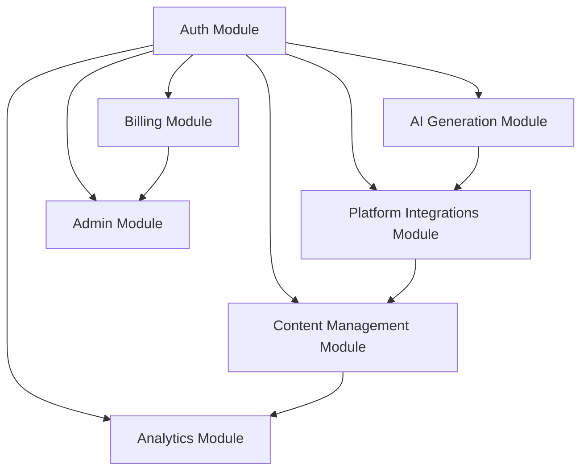

# Claude Memory - Burstlet Development Journal

## Project Overview
Burstlet.com is a SaaS platform that automates content creation and distribution across multiple social media platforms using AI. Following Van Moose modular architecture principles.

## Current Status
- **Phase**: Project Structure Setup
- **Date**: 2025-01-09
- **Developer**: Working with Claude Code

## Module Development Progress

### Completed
- [x] Project structure setup
- [x] README.md creation
- [x] CLAUDE.md development journal
- [x] Module breakdown and dependencies
- [x] Module specifications (all 7 modules)
- [x] Module directory structure
- [x] Module manifest creation
- [x] Package.json configuration
- [x] Environment variables template
- [x] Git ignore configuration

### In Progress
- [ ] Development environment setup (GitHub, services)

### Planned
- [ ] Authentication module
- [ ] AI generation module
- [ ] Platform integrations module
- [ ] Content management module
- [ ] Analytics module
- [ ] Billing module
- [ ] Admin module

## Module Dependencies



## Technical Stack

### Frontend
- Next.js 14 with App Router
- TailwindCSS + shadcn/ui
- TypeScript
- Zustand for state management
- TanStack Query for data fetching

### Backend
- Node.js with Express
- PostgreSQL with Prisma ORM
- Redis + BullMQ for queues
- TypeScript

### Infrastructure (Van Moose Standard)
- **Frontend**: Vercel
- **Backend**: DigitalOcean App Platform
- **Database**: Supabase PostgreSQL
- **Storage**: Supabase Storage
- **Auth**: Supabase Auth

### Third-Party Services
- **AI**: OpenAI GPT-4 / Claude API
- **Video Generation**: HailuoAI API
- **Payments**: Stripe
- **Email**: Resend

## Key Design Decisions

1. **Modular Architecture**: Each module is self-contained with clear interfaces
2. **Agent-First Design**: APIs designed for AI agents with MCP compatibility
3. **TypeScript Everywhere**: Full type safety across frontend and backend
4. **Queue-Based Processing**: Video generation and social media posting via Redis queues
5. **OAuth Integration**: Direct platform integrations for content posting

## Development Phases

### Phase 1: MVP (Weeks 1-2)
- [ ] Basic authentication (Google OAuth)
- [ ] Single video generation
- [ ] YouTube Shorts integration
- [ ] Simple dashboard
- [ ] Basic analytics

### Phase 2: Multi-Platform (Weeks 3-4)
- [ ] TikTok integration
- [ ] Instagram Reels integration
- [ ] Twitter/X integration
- [ ] Scheduling system
- [ ] Enhanced video preview

### Phase 3: Growth Features (Weeks 5-6)
- [ ] Blog generation
- [ ] Advanced analytics
- [ ] Team collaboration
- [ ] Template library
- [ ] A/B testing

## Module Specifications Status

| Module | Status | Lines | Tests | Dependencies |
|--------|--------|-------|-------|-------------|
| auth | ✅ Spec Complete | 0 | 0 | None |
| ai-generation | ✅ Spec Complete | 0 | 0 | auth |
| platform-integrations | ✅ Spec Complete | 0 | 0 | auth |
| content-management | ✅ Spec Complete | 0 | 0 | auth, ai-generation |
| analytics | ✅ Spec Complete | 0 | 0 | auth, platform-integrations |
| billing | ✅ Spec Complete | 0 | 0 | auth |
| admin | ✅ Spec Complete | 0 | 0 | auth, billing |

## Current Blockers
- None

## Next Steps
1. Create module manifest and directory structure
2. Write detailed module specifications
3. Start with authentication module implementation
4. Set up testing framework

## Important Notes
- Follow Van Moose principle: files must be under 500 lines
- Each module must have comprehensive tests
- All APIs must be agent-ready with semantic documentation
- Security-first approach with rate limiting and encryption

## Environment Variables Needed
```bash
# Database
DATABASE_URL=

# Supabase
SUPABASE_URL=
SUPABASE_ANON_KEY=
SUPABASE_SERVICE_KEY=

# AI Services
OPENAI_API_KEY=
HAILUOAI_API_KEY=

# Social Media APIs
YOUTUBE_CLIENT_ID=
YOUTUBE_CLIENT_SECRET=
TIKTOK_CLIENT_ID=
TIKTOK_CLIENT_SECRET=
INSTAGRAM_CLIENT_ID=
INSTAGRAM_CLIENT_SECRET=
TWITTER_CLIENT_ID=
TWITTER_CLIENT_SECRET=

# Payments
STRIPE_SECRET_KEY=
STRIPE_WEBHOOK_SECRET=

# Email
RESEND_API_KEY=

# Storage
STORAGE_BUCKET=
```

## Recent Changes
- 2025-01-09: Created project structure and README
- 2025-01-09: Initialized CLAUDE.md development journal
- 2025-01-09: Created complete module breakdown with dependencies
- 2025-01-09: Wrote comprehensive specifications for all 7 modules
- 2025-01-09: Set up directory structure following Van Moose standards
- 2025-01-09: Configured package.json with workspace support
- 2025-01-09: Created environment configuration and git ignore

## TODO
- [ ] Initialize Git repository and push to GitHub
- [ ] Set up Vercel project and deployment
- [ ] Configure Supabase project and database
- [ ] Set up DigitalOcean app platform
- [ ] Configure Stripe for billing
- [ ] Start implementing authentication module
- [ ] Set up testing framework with Playwright
- [ ] Configure CI/CD pipeline